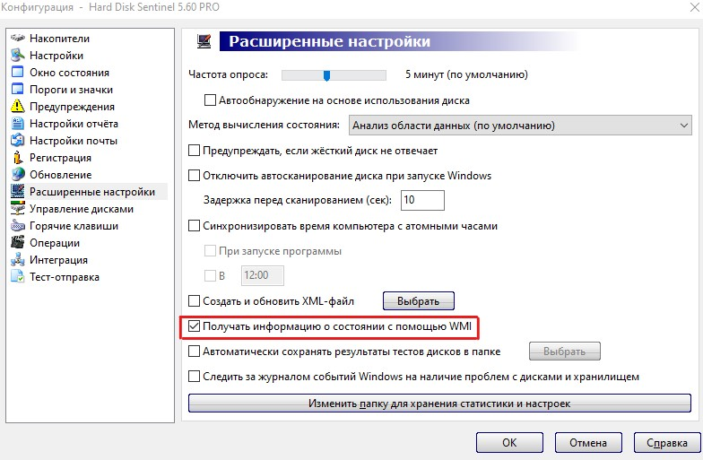

# Отправка сообщения о состоянии HDD/SSD в Telegram

Скрипт получает информацию о состоянии жесткого диска от Hard Disk Sentinel с помощью функции WMI и отправляет сообщение в Terlegram

Для работы скрипта должна быть установленна программа Hard Disk Sentinel и в ней выставлены настройки получения информации с помощью WMI

>

Скрипт можно распространить через груповые политики 
